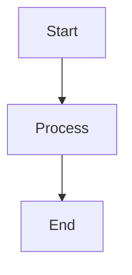

# 🎨 Mermaid Tutorial


[](LICENSE)

## 📋 Table of Contents

- [About](#about)
- [What is Mermaid?](#what-is-mermaid)
- [Examples Included](#examples-included)
- [How to Use](#how-to-use)
- [Viewing Diagrams](#viewing-diagrams)
- [Contributing](#contributing)
- [License](#license)

## 🎯 About

This repository contains practical examples of Mermaid diagrams across different business domains including:
- **Insurance Claims Processing**
- **Telecom Service Subscriptions** (WideCast TV & Data Plans)
- **HR Portal Workflows**

Each example demonstrates best practices for creating clear, maintainable diagrams that can be embedded directly in Markdown files.

## 🖼️ What is Mermaid?

[Mermaid](https://mermaid.js.org/) is a JavaScript-based diagramming and charting tool that uses text-based definitions to create diagrams dynamically. It's supported natively on GitHub, GitLab, and many other platforms.

**Benefits:**
- ✅ Version control friendly (plain text)
- ✅ Easy to maintain and update
- ✅ No external tools required
- ✅ Renders directly in GitHub/Markdown
- ✅ Multiple diagram types supported

## 📊 Examples Included

### 1. **Insurance Claim Process**
Demonstrates a customer interaction flow for filing an insurance claim with a chatbot.

- **File:** `Insurance-Prompt.txt`
- **Diagram Type:** Sequence Diagram

### 2. **WideCast Service Subscription**
Shows various diagram types for a customer signing up for TV and Data plans:

- **Flowchart:** `WideCase-1year-contract-TV-Data-flowchart.md`
- **Sequence Diagram (Version 1):** `WideCast-1year-contract-TV-Data-Sequence diagram.md`
- **Sequence Diagram (Version 2):** `WideCast-1year-contract-TV-Data-Sequence diagram-2.md`
- **Actor-Based Sequence:** `Widecast-1year-contract-TV-Data-Plan-Actor-Sequence diagram.md`
- **Prompt:** `WideCast-Prompt.txt`

### 3. **HR Portal Workflow**
Illustrates employee management and HR processes.

- **File:** `HR-portal.md`
- **Diagram Type:** Process/Workflow Diagram

## 🚀 How to Use

### Viewing Locally

1. **Clone the repository:**
   ```bash
   git clone https://github.com/Poorna-Chandra-D/Mermaid-Tutorial.git
   cd Mermaid-Tutorial
   ```

2. **Open any `.md` file** in a Mermaid-compatible viewer:
   - GitHub (just browse the files online)
   - VS Code with [Mermaid Preview Extension](https://marketplace.visualstudio.com/items?itemName=vstirbu.vscode-mermaid-preview)
   - [Mermaid Live Editor](https://mermaid.live/)

### Using in Your Projects

1. Copy the Mermaid code block from any example file
2. Paste it into your Markdown file wrapped in triple backticks:

````markdown

````

3. The diagram will render automatically on GitHub, GitLab, or any Mermaid-supported platform

## 👀 Viewing Diagrams

### On GitHub
Simply click on any `.md` file in this repository - GitHub will render the Mermaid diagrams automatically!

### Using Mermaid Live Editor
1. Visit [mermaid.live](https://mermaid.live/)
2. Copy the Mermaid code from any example
3. Paste it into the editor to see it rendered

### In VS Code
Install the [Markdown Preview Mermaid Support](https://marketplace.visualstudio.com/items?itemName=bierner.markdown-mermaid) extension, then preview any `.md` file.

## 🤝 Contributing

Contributions are welcome! If you have interesting Mermaid diagram examples:

1. Fork this repository
2. Create a new branch (`git checkout -b feature/new-diagram`)
3. Add your diagram with a descriptive filename
4. Commit your changes (`git commit -m 'Add: new diagram for [use case]'`)
5. Push to the branch (`git push origin feature/new-diagram`)
6. Open a Pull Request

## 📝 License

This project is licensed under the Apache License 2.0 - see the [LICENSE](LICENSE) file for details.

---

## 📚 Additional Resources

- [Mermaid Official Documentation](https://mermaid.js.org/)
- [Mermaid Syntax Reference](https://mermaid.js.org/intro/syntax-reference.html)
- [Mermaid Live Editor](https://mermaid.live/)
- [GitHub's Guide to Mermaid](https://docs.github.com/en/get-started/writing-on-github/working-with-advanced-formatting/creating-diagrams)

---

**Made with ❤️ by [Poorna-Chandra-D](https://github.com/Poorna-Chandra-D)**
