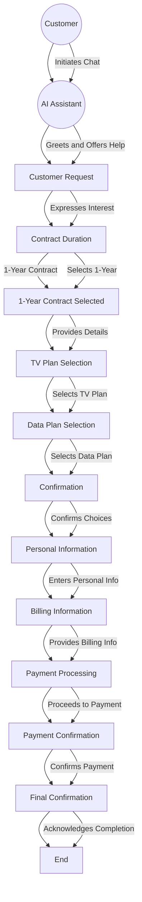

 

```mermaid

flowchart TD;
    A[Start] --> B[Introduction]
    B --> C[Customer Request]
    C --> D[Contract Duration]
    D -->|1-Year Contract| E[1-Year Contract Selected]
    E --> F[TV Plan Selection]
    F --> G[Data Plan Selection]
    G --> H[Confirmation]
    H --> I[Personal Information]
    I --> J[Billing Information]
    J --> K[Payment Processing]
    K --> L[Payment Confirmation]
    L --> M[Final Confirmation]
    M --> N[End]

    A((Customer)) -->|Initiates Chat| B((AI Assistant))
    B -->|Greets and Offers Help| C
    C -->|Expresses Interest| D
    D -->|Selects 1-Year| E
    E -->|Provides Details| F
    F -->|Selects TV Plan| G
    G -->|Selects Data Plan| H
    H -->|Confirms Choices| I
    I -->|Enters Personal Info| J
    J -->|Provides Billing Info| K
    K -->|Proceeds to Payment| L
    L -->|Confirms Payment| M
    M -->|Acknowledges Completion| N


```
