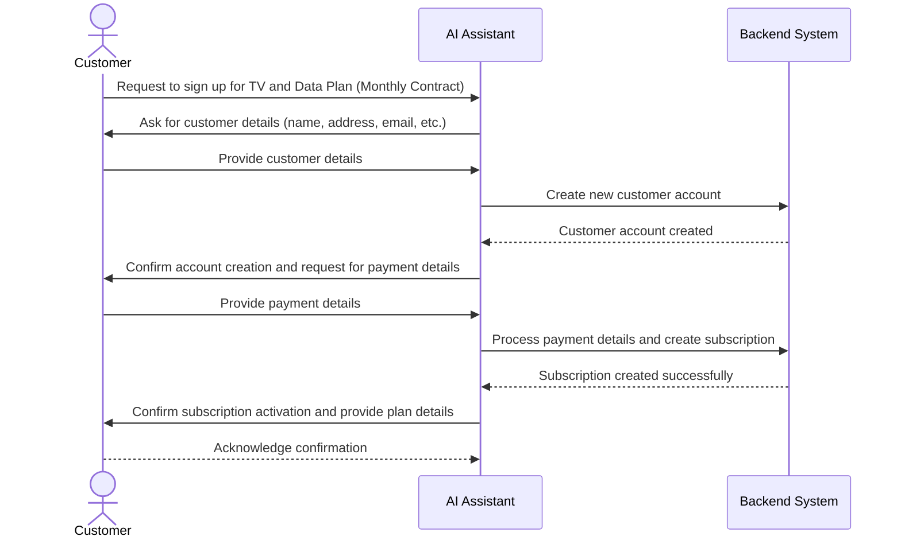

 

```mermaid

sequenceDiagram
    actor Customer
    participant AI_Assistant as AI Assistant
    participant System as Backend System
    
    Customer->>AI_Assistant: Request to sign up for TV and Data Plan (Monthly Contract)
    AI_Assistant->>Customer: Ask for customer details (name, address, email, etc.)
    Customer->>AI_Assistant: Provide customer details
    AI_Assistant->>System: Create new customer account
    System-->>AI_Assistant: Customer account created
    AI_Assistant->>Customer: Confirm account creation and request for payment details
    Customer->>AI_Assistant: Provide payment details
    AI_Assistant->>System: Process payment details and create subscription
    System-->>AI_Assistant: Subscription created successfully
    AI_Assistant->>Customer: Confirm subscription activation and provide plan details
    Customer-->>AI_Assistant: Acknowledge confirmation


```
